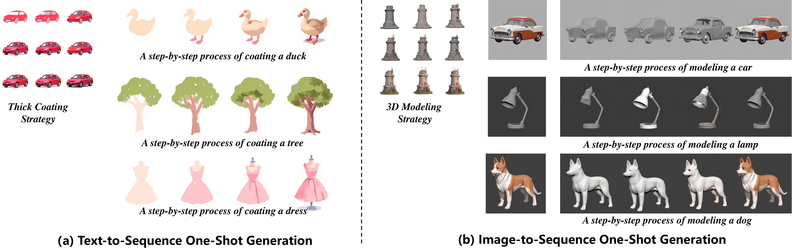

# StrategyAdapter
StrategyAdapter: One-Shot Learning for Unseen-Domain Procedural Sequence Generation



## Configuration
### Environment setup
git clone https://github.com/LUYserena/StrategyAdapter.git
cd StrategyAdapter
conda create -n strategyadapter python=3.11.10
conda activate strategyadapter

### Requirements installation
```
pip install torch==2.5.1 torchvision==0.20.1 torchaudio==2.5.1 --index-url https://download.pytorch.org/whl/cu124
pip install --upgrade -r requirements.txt
```

## Download
### Models
You can download our pretrained model checkpoints from the following link:

👉 [Download from Baidu](https://pan.baidu.com/s/1KyN10jbUeEkN9KXnan9geQ?pwd=yjcu)

## Quick Start
```python
from PIL import Image

import torch

from src.pipeline_flux_ipa import FluxPipeline
from src.transformer_flux import FluxTransformer2DModel
from src.attention_processor import IPAFluxAttnProcessor2_0
from src.adapter import IPAdapter, resize_img

image_encoder_path = "google/siglip-so400m-patch14-384"
ipadapter_path = "models/strategy_adapter.bin"
    
transformer = FluxTransformer2DModel.from_pretrained(
    "black-forest-labs/FLUX.1-dev", subfolder="transformer", torch_dtype=torch.bfloat16
)

pipe = FluxPipeline.from_pretrained(
    "black-forest-labs/FLUX.1-dev", transformer=transformer, torch_dtype=torch.bfloat16
)

ip_model = IPAdapter(pipe, image_encoder_path, ipadapter_path, device="cuda", num_tokens=128)

image_dir = "./assets/strategy.png"
image_name = image_dir.split("/")[-1]
image = Image.open(image_dir).convert("RGB")
image = resize_img(image)

prompt = "3*3 puzzle of 9 sub-images, step-by-step painting process"
    
images = ip_model.generate(
    pil_image=image, 
    prompt=prompt,
    scale=0.9,
    width=1024, height=1024,
    seed=42
)

images[0].save(f"results/{image_name}")

```
